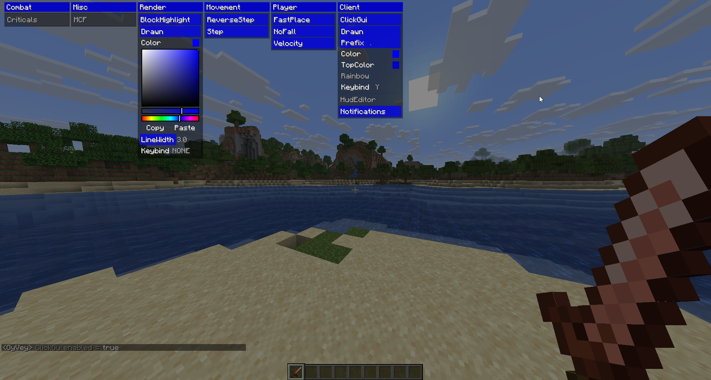
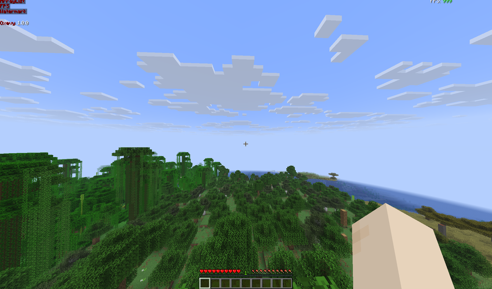
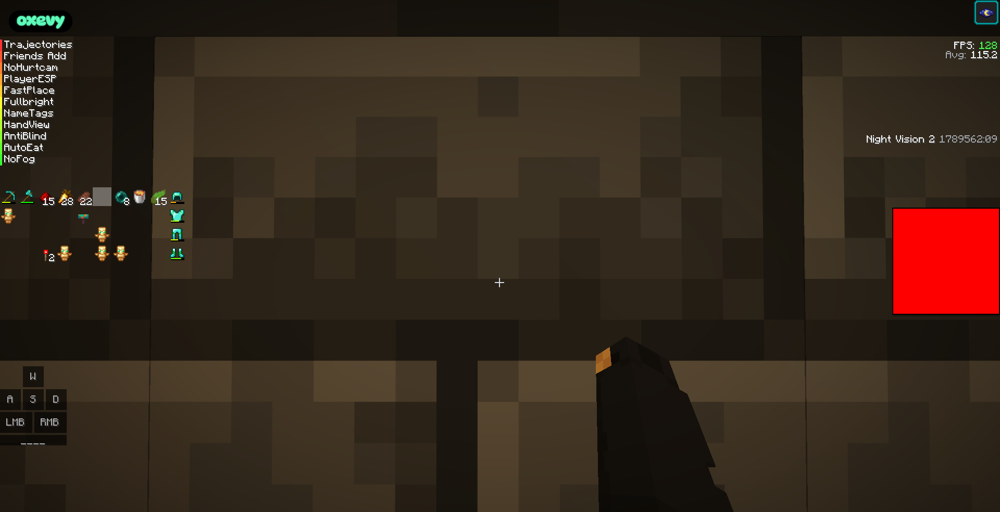

# OxeVy

<div align="center">

**!!!!WARNING THIS PROJECT IS IN BETA!!!!**

**An AI based utility client on OyVey-Ported**

Built with: ChatGPT • DeepSeek • OpenCode • Gemini • Cursor

[](https://opensource.org/licenses/MIT)
[](https://github.com/daneq1/oxevy)
[](https://www.minecraft.net/)
[](https://fabricmc.net/)

</div>

## Sneak Peek


## Preview

### OyVey-Ported


### OxeVy UI



## Technologies Used

| AI Tool | Purpose |
|---------|---------|
| ChatGPT | Code optimization and feature implementation |
| DeepSeek | Prompt engineering |
| OpenCode | Open-source best practices |
| Gemini | UI/UX improvements |
| Cursor | Development assistance |

## Requirements

- Java 21
- Minecraft 1.21.11
- Fabric Loader 0.18.4+
- Fabric API

## Installation

1. Clone the repository
   ```bash
   git clone https://github.com/daneq1/oxevy.git
